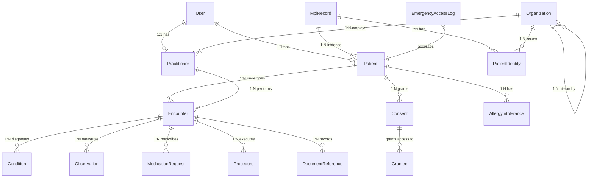

# Database Entity-Relationship Diagram (ERD)

This represents the schema layout for the SehatKu EHR platform based on FHIR R4 mapping.

## Schema Entities (PostgreSQL via Prisma)

- **Identity & MPI Domain:** User, Patient, MpiRecord, PatientIdentity, Practitioner, Organization
- **Clinical Domain:** Encounter, Condition, Observation, Procedure, MedicationRequest, AllergyIntolerance, DocumentReference
- **Audit & Security:** Consent, AuditEvent, EmergencyAccessLog
